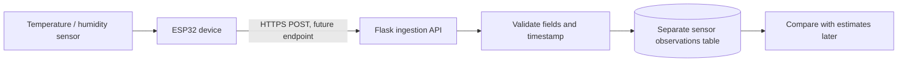

# Optional IoT Sensor Extension

## Status

This is a design only. The base ShadowNav app does not include ESP32 firmware,
a sensor-observation API, an MQTT broker, a sensor database table, or real
sensor readings. The core map and route demo does not require IoT hardware.

## Proposed data flow



For a small student demonstration, sending an occasional HTTP(S) JSON request
is simpler than adding a message broker. ESP-IDF provides an HTTP/S client for
device applications ([official documentation](https://docs.espressif.com/projects/esp-idf/en/v6.0/esp32/api-reference/protocols/esp_http_client.html)).
If the project later has multiple frequently reporting devices, MQTT
publish/subscribe is an alternative; Espressif documents its ESP-MQTT client
and TLS examples ([official documentation](https://docs.espressif.com/projects/esp-idf/en/stable/esp32s3/api-reference/protocols/mqtt.html)).

## Suggested prototype hardware

- ESP32 development board with Wi-Fi.
- A temperature and relative-humidity sensor module.
- A suitable radiation shield or sheltered placement for outdoor air readings.
- GPS only for a mobile sensor. A fixed station can use configured coordinates.
- Optional wind sensor if the study specifically needs wind observations.

Select a sensor only after checking its datasheet, accuracy, environmental
limits, and calibration needs. Do not treat an unshielded sensor in direct sun
as a reliable air-temperature reference.

## Future request payload

This is a schema example, not a measured reading:

```json
{
  "sensor_id": "station-001",
  "latitude": 12.9716,
  "longitude": 77.5946,
  "temperature_c": 30.2,
  "relative_humidity_percent": 56.0,
  "timestamp_utc": "2026-10-03T12:00:00Z"
}
```

The future ingestion endpoint should validate finite coordinates, humidity
range, timestamps, and body size; reject stale or malformed records; and store
measured observations separately from estimated heat values. `sensor_id` should
identify a device, not a person.

## Network and security boundary

The current Flask server binds to `127.0.0.1`. An ESP32 on Wi-Fi cannot reach
that loopback address. Do not change the host to `0.0.0.0` as a quick fix for a
public or shared network. A future device test needs a deliberate network setup,
device authentication, TLS, and firewall rules; secrets must not be embedded in
firmware shared in a public repository.

The current local API also has no device authentication or sensor-ingestion
route. Until those are implemented, do not send sensor records to ShadowNav.

## Validation use

Keep raw observations, timestamps, sensor metadata, and quality flags. Compare
them with predictions for the same place and time only after checking sensor
quality. Preserve rejected or suspect readings with their quality flag rather
than silently presenting them as valid. See [`VALIDATION.md`](VALIDATION.md)
and the blank [validation observation template](../data/sample/validation_observations_template.csv).
