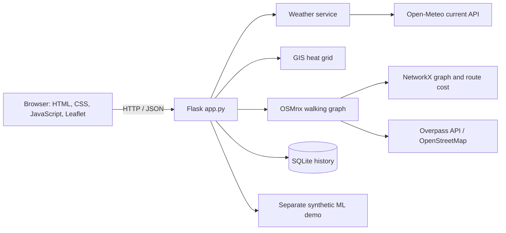

# ShadowNav Project Report

> **Draft for academic review.** Replace every bracketed institutional field, add your own screenshots, and attach the exact test output from your Windows run before submission. This report describes the current local prototype as implemented; it does not claim measured street temperatures or real-world prediction accuracy.

## Cover page

**SHADOWNAV: HYPER-LOCAL URBAN HEAT ISLAND PREDICTION AND COOL-ROUTE NAVIGATION SYSTEM**

A project report submitted in partial fulfilment of the requirements for the degree of **[Degree and Branch]**

- Submitted by: **[Student name]**
- Register number: **[Register number]**
- Project guide: **[Guide name and designation]**
- Department: **[Department]**
- Institution: **[College / University]**
- Academic year: **[Academic year]**

## Certificate

This is to certify that the project report entitled **“ShadowNav: Hyper-Local Urban Heat Island Prediction and Cool-Route Navigation System”** is a record of work carried out by **[Student name and register number]** under my supervision, in partial fulfilment of the requirements for **[degree/programme]** at **[institution]** during **[academic year]**.

**Project guide:** ____________________  **Head of Department:** ____________________  **Date:** __________

> Obtain the final wording and signatures from your institution. This draft is not an issued certificate.

## Declaration

I, **[Student name]**, declare that this project report is based on work carried out for the project titled **“ShadowNav: Hyper-Local Urban Heat Island Prediction and Cool-Route Navigation System.”** Sources, external data services, and software used are identified in the report. Synthetic teaching data and prototype estimates are explicitly distinguished from observed measurements.

**Signature:** ____________________  **Date:** __________

## Acknowledgement

I thank **[project guide]**, **[department/institution]**, and the people who provided academic and technical guidance during this project. I also acknowledge the OpenStreetMap contributors, the Open-Meteo service, and the developers and maintainers of the open-source libraries used by the prototype.

## Abstract

Urban heat varies within cities, while ordinary pedestrian navigation generally focuses on distance or travel time. ShadowNav is a local web prototype that combines current weather-model data, OpenStreetMap walking-network geometry, a spatial heat proxy, and configurable graph costs to demonstrate heat-aware route comparison. The application uses Flask, Python, Leaflet, OSMnx, NetworkX, and SQLite. It displays a neighbourhood-scale map centred on Bengaluru coordinates, accepts source and destination points, and can return shortest, balanced, and cooler walking-route candidates with distance, estimated walking time, estimated average and maximum heat, a distance-weighted exposure proxy, and the share of route length above the project’s high-risk threshold.

The map heat layer is not a trained model. It applies a transparent centre-distance offset and a small solar-radiation adjustment to a current Open-Meteo model-grid air-temperature value. The separate machine-learning demonstration compares Linear Regression, Random Forest, and Histogram Gradient Boosting using 2,500 synthetic rows created from an arbitrary teaching formula. Linear Regression was selected by validation MAE. On the saved synthetic test split of 500 rows, the reported MAE was 0.232 °C, RMSE was 0.290 °C, and R² was 0.998. These values describe fit to generated labels only and are not real-world heat-prediction accuracy. No independent sensor dataset, field validation, or systematic performance benchmark is available in this project version. The prototype demonstrates a complete software workflow while keeping these scientific limitations explicit.

**Keywords:** urban heat island, pedestrian routing, GIS, OpenStreetMap, Flask, heat exposure, synthetic machine learning.

## Table of contents

Generate page numbers after transferring this Markdown draft into the institution’s report template. Suggested chapter order:

1. Introduction and problem definition
2. Background and literature survey
3. Requirements and system design
4. Data and methodology
5. Implementation
6. Results and validation
7. Limitations and future work
8. Conclusion and references

## List of figures

Add final screenshots and update page numbers.

1. ShadowNav dashboard and study map — **[insert screenshot]**
2. Prototype heat-grid layer and legend — **[insert screenshot]**
3. Source, destination, and route comparison — **[insert screenshot]**
4. Synthetic-model metrics panel — **[insert screenshot]**
5. ShadowNav component architecture — diagram in Chapter 3

## List of tables

1. Functional requirements
2. Software stack
3. Synthetic feature definitions
4. Model validation comparison
5. Held-out synthetic test metrics
6. Validation and evidence status
7. Route comparison results — **[fill from an actual run]**

# Chapter 1 — Introduction

## 1.1 Background

Urban surfaces and built form can create local temperature differences. These patterns are often discussed under the urban heat island (UHI) concept. A city-wide weather value cannot describe every street, and a pedestrian’s route determines which local environments they pass through. Research on local climate zones emphasizes describing urban form systematically when studying urban temperatures [1]. Research on pedestrian route choice also reports that heat stress can influence perceived walking distance and access [3].

ShadowNav explores a software response to this problem: display an explicit prototype heat layer and compare pedestrian paths using a configurable heat penalty. The implementation is intentionally small enough to run locally on a student Windows laptop.

## 1.2 Problem statement

Distance-oriented navigation does not, by itself, compare estimated thermal exposure across pedestrian routes. At the same time, dense ground-truth temperature observations, shade geometry, and detailed surface data are not available in this project. The problem addressed is therefore two-part: implement a reproducible heat-aware navigation prototype, and communicate clearly where available inputs are only proxies rather than measurements.

## 1.3 Motivation

The project provides a practical way to demonstrate how weather services, spatial grids, walking-road graphs, route-cost design, web mapping, and data persistence can be combined. It also provides a basis for later work with calibrated environmental sensors and defensible urban-form features.

## 1.4 Objectives

- Retrieve current weather-model variables for a requested coordinate.
- Display a neighbourhood-scale interactive OpenStreetMap view.
- Construct a grid-based, clearly labelled prototype heat-risk layer.
- Obtain pedestrian-network geometry and calculate graph routes.
- Compare shortest, balanced, and cooler route preferences.
- Report route distance, estimated time, and prototype heat metrics.
- Save and retrieve route and synthetic prediction history locally.
- Demonstrate a separate machine-learning training and evaluation pipeline without presenting generated labels as real observations.

## 1.5 Scope

The configured map centre is latitude 12.9716, longitude 77.5946. The grid is 8 by 8 cells over a small bounding box extending 0.02 degrees in each cardinal direction from the selected centre; the walking graph uses that neighbourhood-scale bounding box and a cached OpenStreetMap network. The scope is a local student prototype, not full Bengaluru coverage or a public safety service.

Included: Flask web application, Leaflet map, weather API integration, heat proxy, OSM pedestrian graph, NetworkX route calculation, SQLite history, and synthetic-only regression demonstration.

Not included: real street-temperature sensing, measured land cover, building-shadow simulation, medical advice, authenticated multi-user operation, a sensor-ingestion endpoint, or a production deployment.

## 1.6 Existing and proposed systems

Conventional shortest-path navigation can return a distance-oriented path, but does not necessarily expose a heat-related route comparison. Academic systems demonstrate richer methods: route-choice modelling with heat stress [3], time-varying shade-oriented routing [4], and mean-radiant-temperature routing supported by urban form and field measurements [5]. ShadowNav is a much smaller educational prototype. It uses a transparent, simplified penalty and does not reproduce the data resolution or validation of those studies.

# Chapter 2 — Literature survey

## 2.1 Local Climate Zones

Stewart and Oke proposed the Local Climate Zone (LCZ) framework to classify urban and natural settings in a standard way for urban temperature studies [1]. This supports the principle that urban form matters to heat analysis. ShadowNav does not calculate LCZ classes: it has no validated land-cover or building-form dataset in the current implementation. Its centre-distance offset is a simple demonstration proxy and must not be described as an LCZ-derived prediction.

## 2.2 Graph-based OpenStreetMap networks

Boeing introduced OSMnx as a Python package for working with graph-theoretic OpenStreetMap street networks, including network acquisition, graph construction, and path analysis [2]. ShadowNav uses OSMnx to request a walk network and store a GraphML cache, then uses NetworkX for path search. The quality and completeness of returned paths depend on the mapped pedestrian network and external Overpass availability.

## 2.3 Heat and pedestrian route choice

Basu, Colaninno, Alhassan, and Sevtsuk analysed pedestrian trips in Boston using route attributes and Universal Thermal Climate Index (UTCI) within path-size logistic regression models. They report that heat stress affected perceived walking distance and accessibility in their study context [3]. This motivates treating heat as a route attribute, but its numerical findings cannot be transferred to ShadowNav’s Bengaluru prototype or its synthetic estimate.

## 2.4 Shade-oriented pathfinding

Wen and colleagues evaluated a dynamic shade-oriented pathfinding method around Dubai metro stations, considering building, tree, and indoor shade [4]. Their work illustrates the value of time and shade information. ShadowNav does not have building shade, tree canopy, indoor routes, or a solar-position model, so its “cooler” route is not a shade guarantee.

## 2.5 Real-time thermal exposure routing

Buo and colleagues describe a pedestrian routing system using mean radiant temperature (MRT), SOLWEIG, urban-form data, walkable paths, and a modified Dijkstra algorithm, with field comparisons on selected routes [5]. This provides a more advanced research direction for future ShadowNav versions. ShadowNav’s temperature proxy is not MRT and its saved synthetic ML metrics are not comparable to this study’s field validation.

## 2.6 Research gap and project position

The cited studies use richer urban-climate inputs and/or observed route data than the current project. ShadowNav’s contribution at this stage is an educational, end-to-end local prototype and an inspectable route-cost mechanism. The project does not claim a new validated heat model or a scientifically optimal route preference.

# Chapter 3 — Requirements and system design

## 3.1 Functional requirements

| ID | Requirement | Implementation status |
|---|---|---|
| FR1 | Display the homepage and map | Implemented |
| FR2 | Retrieve current weather fields | Implemented through Flask weather service |
| FR3 | Produce a spatial heat layer | Implemented as a prototype proxy |
| FR4 | Select source and destination and draw a walking route | Implemented; verify locally before report submission |
| FR5 | Offer shortest, balanced, and cooler modes | Implemented |
| FR6 | Return distance, time, heat, and high-risk length share | Implemented using prototype estimates |
| FR7 | Store and read route history | Implemented in SQLite |
| FR8 | Train, compare, and expose a synthetic ML demonstration | Implemented separately from map routing |
| FR9 | Store and delete synthetic demo prediction history | Implemented in SQLite |
| FR10 | Provide API status and structured error responses | Implemented |

## 3.2 Non-functional requirements

- Run locally on Windows with Python 3.11+ and a virtual environment.
- Keep modules separated by service responsibility.
- Avoid API secrets in browser JavaScript.
- Validate route coordinates and limit request bodies.
- Provide visible OpenStreetMap attribution.
- Use local SQLite and avoid collecting account identities.
- Return useful errors when internet-dependent services fail.

## 3.3 Architecture



The browser requests application endpoints. Flask validates input and calls Python services. Weather data is requested server-side and normalized. The heat-grid module combines the weather base temperature with explicit offsets. The routing module loads a cached OSM pedestrian graph, snaps coordinate inputs to graph nodes, assigns each edge a cost, finds a path, calculates metrics, and returns GeoJSON. Database helpers persist route results and synthetic model-demo predictions.

## 3.4 Main data flow

1. Browser loads the dashboard and initializes Leaflet.
2. Browser retrieves weather, heat-grid, and road data through Flask APIs.
3. User selects start and end coordinates inside the configured study bounds.
4. Flask validates the coordinates and mode.
5. Routing service loads the cached walking graph or requests it from Overpass.
6. Each edge midpoint receives the same prototype heat estimate used by the grid.
7. NetworkX calculates a path under the requested generalized cost.
8. Flask returns GeoJSON and route metrics, then attempts to save history in SQLite.
9. The browser renders candidate lines, route cards, and history.

## 3.5 Technology stack

| Technology | Use in this prototype | Cost / key | Limitation |
|---|---|---|---|
| Python | Backend, GIS, ML, route logic | Open source; no key | Runtime dependencies can be large on Windows |
| Flask | Local HTTP server and REST endpoints | Open source; no key | Development server is not production hosting |
| HTML/CSS/JavaScript | Browser dashboard | Open standards | Browser network access is needed for CDN resources |
| Leaflet 1.9.4 | Interactive map layers and controls | Open source | Base tiles depend on external tile service policy |
| OpenStreetMap | Base map and road data | Open data; no account key for current workflow | Coverage varies; tile service is best-effort |
| Open-Meteo | Current weather-model fields | Current integration uses no API key | Grid weather is not a street thermometer |
| OSMnx | Download and cache walk graph | Open source; no key | Overpass can be unavailable or rate-limited |
| NetworkX | Weighted graph path calculation | Open source | Does not improve source-data completeness |
| NumPy, Pandas, scikit-learn, Joblib | Synthetic dataset and ML demonstration | Open source | Results depend on generated teaching formula |
| SQLite | Local history persistence | Built in; no server/key | Single-computer prototype storage |
| pytest | Automated unit/API checks | Open source | Suite result must be captured from local execution |

GeoPandas is present as a dependency and helps compatibility checks used around OSMnx, but the current route computation does not build an advanced GeoPandas feature pipeline. PostgreSQL/PostGIS, XGBoost, Rasterio, Chart.js, and a cloud service are not required for the implemented local prototype.

## 3.6 Hardware and software requirements

- Windows 10/11 computer; 8 GB RAM is preferred for smooth development.
- Python 3.11 or later, Visual Studio Code, and Git.
- Internet access for weather, map tiles, and the initial OSM walking-graph request.
- Browser with JavaScript enabled.
- Local disk space for the virtual environment, model artifact, graph cache, and SQLite database.

## 3.7 API summary

The full request/response definitions and examples are in [`API.md`](API.md).

| Method | Endpoint | Purpose |
|---|---|---|
| GET | `/` | Dashboard |
| GET | `/api/status` | JSON health status |
| GET | `/api/weather` | Normalized current weather |
| GET | `/api/heatmap` | Prototype grid as GeoJSON |
| GET | `/api/roads` | Walking edges with prototype properties |
| POST | `/api/route` | One selected route mode |
| POST | `/api/routes` | Three-mode route comparison |
| GET / DELETE | `/api/history` and `/api/history/<id>` | Read or delete route history |
| POST | `/api/predict` | Synthetic-only trained-model demonstration |
| GET / DELETE | `/api/predictions` and `/api/predictions/<id>` | Read or delete synthetic demo history |
| GET | `/api/ml/metrics` | Read saved synthetic validation/test results |

# Chapter 4 — Data and methodology

## 4.1 Weather data

The server requests current values from Open-Meteo: 2 m air temperature, relative humidity, apparent temperature, WMO weather code, cloud cover, precipitation, 10 m wind speed and direction, and shortwave radiation. The service normalizes provider keys, units, location metadata, time, and a readable weather-condition label. It uses a timeout and a short in-process cache. The values represent weather-model output at a grid location; they do not resolve street-by-street surface or shade differences. Open-Meteo documents the API fields and notes that some convenience variables may be derived from model inputs [6].

## 4.2 Geographic data

OpenStreetMap supplies road and path geometry through OSMnx’s Overpass query. The graph is restricted to a walk network, stored as a directed multigraph, reduced to the largest connected component, and cached in GraphML for subsequent requests. The map background uses OpenStreetMap-compatible raster tiles. OSM data and tile imagery do not include temperature measurements. Any public or shared tile use must retain visible attribution and comply with the tile service’s use policy [7].

No measured vegetation, building density, surface albedo, elevation-derived shade, or sensor observations are currently used in the map heat estimate. The synthetic ML demonstration’s “vegetation” and “building density” inputs are generated numbers, not GIS measurements.

## 4.3 Prototype spatial heat estimate

For each grid cell or road-edge midpoint, the implementation uses:

`estimated temperature = model-grid air temperature + centre-distance UHI proxy + solar bump`

The centre-distance term linearly decreases from a configured maximum of 2.0 °C to zero over a 2 km radius. The solar bump is 0.4 °C when reported shortwave radiation exceeds 500 W/m² and 0 otherwise. These fixed rules create a spatially varying demonstration layer; they are not calibrated from measured Bengaluru street data and are not a physical urban climate model.

The grid contains 8 × 8 = 64 cells. Project-defined visual categories are Low below 28 °C, Moderate from 28 to below 32 °C, High from 32 to below 36 °C, and Very High at or above 36 °C. These are display bands only, not medical guidance or official heat warnings.

## 4.4 Synthetic ML dataset

The generator creates 2,500 rows by default using random seed 42. It creates seven inputs: air-temperature-like value, humidity-like value, solar-radiation-like value, wind-speed-like value, distance-to-centre proxy, vegetation proxy, and building-density proxy. The target is produced by a deliberately simple arithmetic formula and random noise. Every row is labelled `data_source=synthetic`.

The data is not retrieved from the weather API, a satellite, a sensor, or a land-cover dataset. It has no real spatial or temporal resolution. No missing values are expected from the generator; the loader verifies required columns, numeric finite values, and the synthetic source label. Since every feature and target is generated by the same script, these results assess software workflow and recovery of an artificial formula—not real heat prediction.

The dataset is split into 60% training, 20% validation, and 20% test with fixed seeds: 1,500 / 500 / 500 rows for the default 2,500-row dataset. Model selection uses validation MAE. The chosen estimator is refitted on training plus validation data; the held-out test partition is evaluated separately. This separation avoids selecting the model directly on the test score. Since generated rows are independent simulations rather than repeated real locations/times, this split does not establish spatial or temporal generalization.

## 4.5 Models and metrics

The implementation compares:

- Linear Regression: baseline linear relationship; standardized numeric inputs are used in a pipeline.
- Random Forest Regressor: tree ensemble baseline with fixed estimator count and seed.
- Histogram Gradient Boosting Regressor: boosting baseline for tabular regression.

For continuous targets, MAE is the average absolute error, RMSE is the square root of average squared error, and R² compares model residual variation with target variation around the mean. Units of MAE and RMSE are the target’s °C-like units. A high R² on the generated data must not be interpreted as real-world performance.

## 4.6 GIS and route pipeline

1. Define a small latitude/longitude bounding box around the configured map centre.
2. Request an OSMnx `walk` network from Overpass and retain the largest connected component.
3. Cache the result as GraphML and save metadata for the study centre and bounds.
4. Find the nearest graph nodes to source and destination coordinates.
5. Estimate heat at each edge midpoint from weather and the prototype spatial formula.
6. Assign a mode-specific generalized cost and run a weighted shortest path using NetworkX.
7. Sum selected edge lengths and calculate output metrics.

The implementation’s per-edge cost is `length × (1 + λ × h)`, where `h = clamp((estimated temperature − 20) / 20, 0, 1)`. The mode multiplier λ is 0 for shortest, 0.7 for balanced, and 1.8 for cooler. These are experimental coefficients. Distance is the base quantity; estimated walking time is calculated after the path using a fixed assumed speed of 5 km/h. Thus, time is reported but is not an independent time penalty in the current edge-cost formula. The selected candidates can be identical if the same path wins under each cost.

Route metrics include length-weighted mean estimated temperature, maximum estimated edge temperature, an exposure proxy calculated as `sum(max(temperature − 20 °C, 0) × edge length in km)`, and the route-length percentage on edges estimated at or above 32 °C. These metrics are only as reliable as the underlying proxy.

## 4.7 Database design

The local SQLite database contains two tables:

- `route_history`: grouped search ID, timestamp, endpoint coordinates, mode, distance, estimated time, heat metrics, risk share, and GeoJSON geometry.
- `prediction_history`: generated demo ID, timestamp, fixed `synthetic` source label, model name, synthetic features, estimate, and disclaimer.

There is no user table and no real sensor table. Route endpoint coordinates are saved because they are needed to reproduce route history. Users can delete saved route searches and individual synthetic prediction entries through API endpoints. The database file is excluded from Git.

# Chapter 5 — Implementation

## 5.1 Application modules

- `app.py`: Flask homepage and REST API handlers, validation, JSON responses, error pages, request-size limit, and response headers.
- `config.py`: map centre, grid extent, API cache/timeout, and debug configuration.
- `services/weather_service.py`: server-side Open-Meteo request, field normalization, timeout handling, and cache.
- `gis/grid.py`, `gis/heat_layer.py`: grid generation and transparent prototype heat estimates.
- `gis/network.py`: OSMnx walk-graph retrieval, connected component, cache, and road GeoJSON.
- `routing/route_service.py`: graph-node snapping, edge cost, route calculation, and route metrics.
- `ml/`: synthetic dataset generation, validation, training, evaluation, and prediction helper.
- `database/db.py`: SQLite schema and route/prediction history operations.
- `templates/`, `static/`: dashboard, styles, and browser-side map behavior.
- `tests/`: unit and Flask API tests, using temporary database files and stubs where applicable.

## 5.2 Security and privacy

The current server binds to `127.0.0.1`, limits request bodies to 16 KB, validates coordinates and IDs, and sets basic browser security headers. Open-Meteo’s current integration requires no key. `.env` is ignored by Git for future configuration. Route history stores locations on the local computer; synthetic prediction history does not store location or user identity. The current app has no authentication, rate limiting, HTTPS setup, or production WSGI server, and debug mode is intended only for local development. Do not expose this configuration directly to the public internet.

## 5.3 Optional IoT design

An ESP32 temperature/humidity sensor could later send timestamped, coordinate-tagged observations to an authenticated ingestion API. Such an API and hardware integration are not implemented. Future sensor readings should be stored separately from model estimates, include sensor metadata and quality flags, and be checked for shielding, placement, calibration, and time alignment before model evaluation.

# Chapter 6 — Results and validation

## 6.1 Saved synthetic ML results

The following values are read from the project’s saved JSON evaluation reports. They are actual saved results from the local project artifacts and apply only to the synthetic teaching dataset.

| Candidate | Validation MAE (synthetic °C-like units) |
|---|---:|
| Linear Regression | 0.2404 |
| Random Forest | 0.4824 |
| Histogram Gradient Boosting | 0.3445 |

Linear Regression was selected because it had the lowest saved validation MAE.

| Held-out test metric | Saved result |
|---|---:|
| Test rows | 500 |
| MAE | 0.2320 °C-like |
| RMSE | 0.2903 °C-like |
| R² | 0.9980 |

These scores quantify approximation of a known generated formula plus noise. They do **not** measure observed air temperature or street-level heat accuracy. No real labelled heat dataset was available for evaluation.

## 6.2 Software and geographic validation status

| Validation item | Evidence available for this report | Result statement |
|---|---|---|
| Homepage and status | Earlier local milestone confirmations in project conversation | User reported these steps complete; no run log attached here |
| Route calculation | Earlier manual route troubleshooting and confirmation in conversation | A route was reported working during development; this report has no route response payload or reproducible saved metrics to quote |
| Automated test suite | 30 cases are documented in `docs/TESTING.md` | Exact final passing output was not captured in the report evidence; run locally and paste output before submission |
| Geographic validation | OSM network and map can be visually inspected | No independent field survey or alignment audit is available |
| Real-world heat validation | No ground-truth observation rows or calibrated sensor data | Not performed |
| Performance | No systematic timings saved | Not measured |

## 6.3 Route comparison results to collect

Fill this table using one actual successful `/api/routes` response or the dashboard. Do not substitute illustrative values.

| Mode | Distance (km) | Time (min) | Average estimate (°C) | Maximum estimate (°C) | Exposure proxy (°C·km) | High-risk segment (%) |
|---|---:|---:|---:|---:|---:|---:|
| Shortest | **[measure]** | **[measure]** | **[measure]** | **[measure]** | **[measure]** | **[measure]** |
| Balanced | **[measure]** | **[measure]** | **[measure]** | **[measure]** | **[measure]** | **[measure]** |
| Cooler | **[measure]** | **[measure]** | **[measure]** | **[measure]** | **[measure]** | **[measure]** |

Record the source/destination coordinates, run timestamp, weather timestamp, whether OSM graph data was cached, and whether the three candidates differed. The algorithm may return the same streets for all modes.

## 6.4 Screenshots and performance

Insert genuine screenshots from the running app: (1) map and heat layer, (2) selected markers, (3) route comparison, and (4) model metrics/history panel. Record timings with a stated computer, browser, network condition, warm/cold graph cache, and repeated-run procedure. No screenshot or response-time value is fabricated in this draft.

## 6.5 Validation levels

1. **Prototype/software validation:** check UI, API responses, error handling, and local database flow.
2. **ML pipeline validation:** currently performed against synthetic labels only.
3. **Geographic validation:** inspect OSM geometry and snapping; this is not temperature validation.
4. **Real-world validation:** requires time- and location-matched measurements from checked sensors; not performed.

# Chapter 7 — Testing

The automated test suite covers heat-risk bands, weather parsing, route cost behavior, SQLite history, API validation, response headers, oversized requests, synthetic-data workflow, and API/database integration. External Open-Meteo and Overpass requests are not required for the unit tests. Browser map rendering and real-network route behavior require manual checks.

Run from PowerShell in the project directory after activating the virtual environment:

```powershell
python -m pytest -q
```

The documentation describes 30 expected cases and says a successful run ends with `30 passed`. This is the expected suite outcome, not a claim that this report author captured a passing run. Paste the exact terminal result here after running it. If any test fails, record the failing name, actual error, fix, and rerun output.

# Chapter 8 — Limitations and future work

## 8.1 Limitations

- Map heat is a rule-based proxy over weather-model grid data, not a trained or measured street-level temperature layer.
- The ML dataset and all model scores are synthetic and cannot establish real-world accuracy.
- Vegetation and building-density proxies are present only as synthetic ML inputs; the live heat map does not derive them from GIS data.
- No shade, surface temperature, mean radiant temperature, or street-canyon model is available.
- The risk bands are project-defined and are not medical categories.
- OSM paths can be missing, misclassified, disconnected, or outdated.
- The walking-time estimate assumes a constant 5 km/h and ignores crossings, slope, mobility needs, and pauses.
- Route weights are hand-selected experimental constants and are not validated as universally optimal.
- The study area is a small local bounding box and the data services depend on internet access.
- Authentication, rate limiting, production hosting, sensor ingestion, and systematic performance tests are not implemented.

## 8.2 Future work

1. Collect properly shielded and checked temperature/humidity observations across street types and times.
2. Add measured land-cover, building form, vegetation, elevation, and solar/shade features with documented provenance and resolution.
3. Train with location/time-aware splits and compare against a weather-only baseline.
4. Evaluate route estimates against field measurements and report uncertainty.
5. Consider UTCI or MRT only when the required meteorology, radiation, and urban-form inputs are available.
6. Test route preference weights with users and report distance-versus-exposure trade-offs.
7. Add forecast-time route planning and a properly authenticated IoT ingestion path.
8. Harden deployment with a production WSGI server, HTTPS, authentication where needed, rate limits, logging, and managed database backups.

# Chapter 9 — Conclusion

ShadowNav implements a neighbourhood-scale web prototype that joins weather retrieval, a visible spatial heat proxy, OSM pedestrian graph routing, route preference modes, route metrics, SQLite history, and a separate synthetic ML workflow. The saved model comparison demonstrates validation-based selection and held-out evaluation on generated examples. The map and route outputs remain estimates built from weather-model data and a simple spatial rule. Since no independent sensor observations, systematic route results, timing measurements, or final test transcript are included here, the project cannot claim real-world temperature accuracy, route safety, or performance guarantees. Its present value is as a transparent software prototype and a foundation for future measured-data validation.

# References

1. Stewart, I. D., & Oke, T. R. (2012). Local Climate Zones for Urban Temperature Studies. *Bulletin of the American Meteorological Society, 93*(12), 1879–1900. https://doi.org/10.1175/BAMS-D-11-00019.1
2. Boeing, G. (2017). OSMnx: A Python package to work with graph-theoretic OpenStreetMap street networks. *Journal of Open Source Software, 2*(12), 215. https://doi.org/10.21105/joss.00215
3. Basu, R., Colaninno, N., Alhassan, A., & Sevtsuk, A. (2024). Hot and bothered: Exploring the effect of heat on pedestrian route choice behavior and accessibility. *Cities, 155*, 105435. https://doi.org/10.1016/j.cities.2024.105435
4. Wen, J., Abuhani, D. A., Mazzarello, M., Duarte, F., Norford, L., Xu, R., Wong, N. H., & Ratti, C. (2025). Walking smart in the heat: A dynamic shade-oriented pathfinding approach to enhance pedestrian comfort in arid cities. *Computers, Environment and Urban Systems, 122*, 102337. https://doi.org/10.1016/j.compenvurbsys.2025.102337
5. Buo, I., Khan, W. H., Crabtree, E., Emmott, F., Hariyani, D., & Middel, A. (2026). Cool routes: Real-time human thermal exposure routing. *Building and Environment, 298*, 114622. https://doi.org/10.1016/j.buildenv.2026.114622
6. Open-Meteo. (n.d.). Forecast API documentation. https://open-meteo.com/en/docs
7. OpenStreetMap Foundation. (n.d.). Tile Usage Policy. https://operations.osmfoundation.org/policies/tiles/
8. Leaflet. (n.d.). Quick Start Guide. https://leafletjs.com/examples/quick-start/

The bibliographic metadata for references 1–5 was checked against the journal/publisher or journal-hosted records. The results summarized here belong to those studies and must not be presented as ShadowNav experiment results.

## Appendix A — Final demo procedure

1. Open PowerShell in the ShadowNav project folder.
2. Activate the environment with `\.venv\Scripts\Activate.ps1`.
3. Start the local application using `python app.py`.
4. Open `http://127.0.0.1:5000/`.
5. Confirm weather and map layers load; retain visible map attribution.
6. Select two points inside the displayed study area.
7. Request shortest, balanced, and cooler candidates.
8. Save screenshots and transcribe only the values returned in the interface/API.
9. Open route history and the separate synthetic-model panel; explain that the ML demo does not power the map layer.
10. Stop Flask with `Ctrl+C` after the demo.

## Appendix B — Evidence checklist before submission

- [ ] Replace institution, student, guide, and academic-year placeholders.
- [ ] Confirm and capture the current dashboard screenshot.
- [ ] Capture a successful three-route comparison and fill in its real values.
- [ ] Run pytest and paste the exact final output.
- [ ] Record computer/browser details and measured response times or state “not measured.”
- [ ] Keep the synthetic-data disclaimer beside every reported ML metric.
- [ ] Confirm citations and required report format with the project guide.
